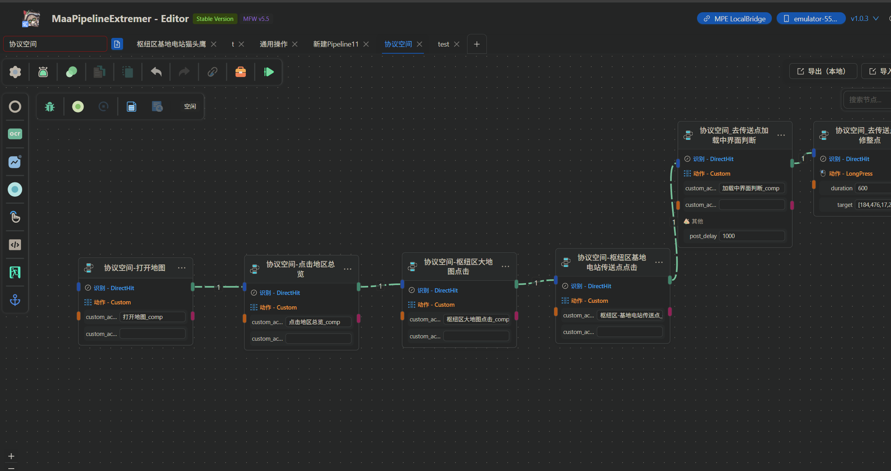
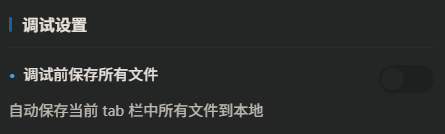
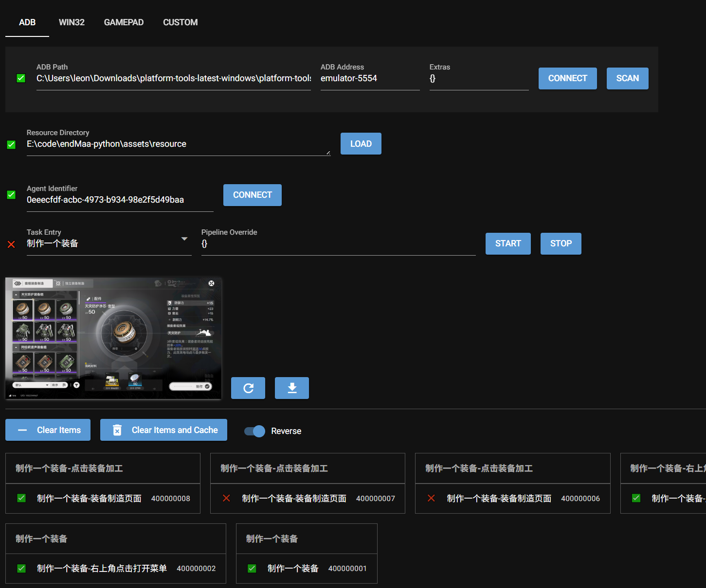
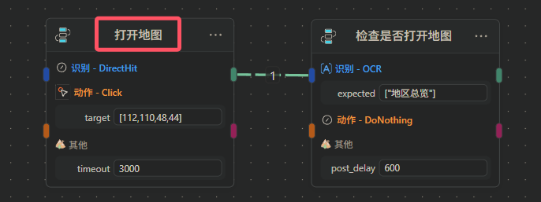

# 项目介绍
基于MaaFramework的python项目，定位是处理收菜等重复操作劳动，拒绝给佩丽卡打黑工

视频介绍：[bilibili.com/video/BV1RxF4znEsU](bilibili.com/video/BV1RxF4znEsU)
## 亮点功能
- 全自动协议空间，自动开始，自动战斗，自动结束战斗。
- 自动跑图领取领取猫头鹰，到达控制中枢控制台
## 目前已实现功能
- 部分地区猫头鹰自动跑图领取
- 打开app
- 协议空间
- 制作一个装备
- 进行1次简易制作
- 日常活跃度领取
- 总控中枢导航到控制台自动收菜（种植室，制造室）
## 主要技术简述
## 自动跑图
3d问题降为为2d问题
1. 神经网络yolov8目标检测负责识别地图中人物坐标箭头
2. 传统算法灰度二值化分离箭头计算人物朝向。
3. 模版匹配负责确定人物当前位置
4. 最终根据以上几点，计算人物应该移动方向和距离，控制人物移动。
### 协议空间自动结束战斗
朝着烟雾方向走就可以了
1. 神经网络yolov8目标检测负责识别地图中战斗结束的烟雾
2. 判断是偏左还是偏右，计算角度把人物朝向调整到烟雾方向
3. 前进固定步长，判断是否到达烟雾位置，即是否有获取奖励文字出现，没有则重复继续。
## 未来可拓展功能
- 菜园自动收菜
- 蚀像寻遗自动刷积分
- 自动刷基质
## 备注
目前仍然处于开发调试阶段，不稳定，部分内容还未解锁，个人的能力和精力是有限的，调试时候遇到的情况无法涵盖所有情况，欢迎大家一起开发调试，一起完善，你敢push我就敢合并。等后续稳定完善之后再打包发布UI。
## 目前已经测试的模拟器
理论上来说，MaaFramework对模拟器兼容是很强的，都应该可以运行，但是目前只测试了mumu12和蓝叠国内版，其他模拟器没有测试
- mumu12
- 蓝叠国内版，需另外下载adb,自带的adb不兼容默写操作,比如longpress。[google adb下载 ](https://dl.google.com/android/repository/platform-tools-latest-windows.zip)
- 模拟器设置720p 240dpi 低画质
# 如何开发
## 安装python开发环境
python 3.10
```bash
pip install -r requirements.txt
```
## 安装MaaFramework发布包
MAA-win-x86_64-v5.5.0.zip,解压后放到deps目录直接覆盖掉。

[MaaFramework发布包v5.5.0下载](https://github.com/MaaXYZ/MaaFramework/releases/tag/v5.5.0)
## 下载需要的模型，放到assets/resource目录下
通过网盘分享的文件：model

链接: https://pan.baidu.com/s/1wFEucQDJsxnAy-1ijkA4Mg 提取码: 8qgn

目录结构为
```
assets/resource/model
```
## adb连接设置
确保模拟器已开启adb调试。确保只有一个模拟器打开。默认连接第一个模拟器
- 如果是mumu12模拟器，会自动识别连接，无需其他设置
- 如果是蓝叠模拟器，如果是蓝叠模拟器，需要指定adb路径,而且第一次运行时候可能会说找不到adb设备，第二次就好了

修改`main.py`
```
    # 如果是蓝叠模拟器，需要指定adb路径
    adb_devices = Toolkit.find_adb_devices(r"C:\Users\leon\Downloads\platform-tools-latest-windows\platform-tools\adb.exe")
    # for mumu12 模拟器
    # adb_devices = Toolkit.find_adb_devices()
```
## 运行项目
确保模拟器里面已经安装了终末地游戏。
```bash
python main.py
```
## main.py中可配置项
- task_entry为要执行的人物入口名称
- pipeline_override为要覆盖的任务流程中的选项，目前为协议空间选择刷什么材料，
```
task_entry = [
        "打开app",
        # "协议空间-打开地图",
        # "制作一个装备",
        # "进行1次简易制作",
        # "日常活跃度领取",
        # "总控中枢"
        # "枢纽区基地电站猫头鹰",
        # "工人之家猫头鹰",
        # "源石研究所猫头鹰",
        # "谷地通道猫头鹰",
        # "矿脉源区医疗站上猫头鹰",
        # "矿脉源区医疗站下猫头鹰",
    ]
    pipeline_override = {
        "协议空间-一级选择": {
            "recognition": {
                "param": {
                    "expected": [
                        "干员养成"
                    ],
                },
            }
        },
        "协议空间-二级选择1": {
            "recognition": {
                "param": {
                    "expected": [
                        "协议空间·干员养成"
                    ],
                },
            }
        },
        "协议空间-二级选择2": {
            "recognition": {
                "param": {
                    "expected": [
                        "协议空间·干员进阶"
                    ],
                },
            }
        },
        "协议空间-等级选择": {
            "recognition": {
                "param": {
                    "expected": [
                        "三级"
                    ],
                },
            }
        }
    }
```

## 可视化编辑器，编辑任务流程
### 使用
[可视化编辑器MaaPipelineEditor](https://endmaa.github.io/endMaa-python-editor/)

- 下载release之后，将mpelb.exe放到assets/resource目录下
- 运行mpelb.exe。打开[可视化编辑器在线网站](https://mpe.codax.site/stable/)
- 进行资源文件配置，模型文件配置，详细的配置教程可参考其文档。

### MaaPipelineEditor调试相关
- **警告！警告！警告！，使用MaaPipelineEditor的在线调试功能时候，请关闭自动保存，目前存在bug会把所有的打开文件使用相同的配置进行保存。**
- **目前MaaPipelineEditor不支持调试本地单独写的python脚本节点。会直接返回错误**



## 本地调试debugger
### MaaDebugger
https://github.com/MaaXYZ/MaaDebugger
安装和启动流程参考其文档。
- 点击扫描后会自动扫描出模拟器，选择模拟器，会自动填入adb address 和 adb path 。如果是蓝叠模拟器，需要再手动替换一下自己下载的adb的路径。
- 资源路径：assets/resource的绝对路径
- Agent ldentifier：先启动`agent/main.py`,然后此处填入`0eeecfdf-acbc-4973-b934-98e2f5d49baa`
- 选择入口，点击start即可开始调试。支持调试本地写的python脚本节点。
- **注意：耗时超长的python脚本节点，调试器会直接返回这一步失败。**，这种节点用代码直接调试吧。


## 项目目录介绍
```
endMaa-python/
├── collect_wheels.py 离线打包python依赖用
├── main.py 本地调试入口
├── assets/ 标准的maa资源目录，存放模型，图片，流水线配置文件等
├── agent/ 本地自定义一些节点的python代码
│   ├── config.py 简单的全局配置
│   ├── custom_action.py 自定义的action节点，
│   ├── custom_reco.py 自定义的recognition节点
│   ├── demo1.py  示例的python脚本节点
│   ├── main.py 给远程UI调用的入口，
│   ├── register_for_local.py  本地注册节点用的代码
│   ├── register_for_remote.py  远程注册节点用的代码
│   ├── utils/
│   │   ├── util.py 一些通用的工具函数
│   │   └── yolo_det.py yolo目标检测模型的推理代码
├── deps/ MaaFramework的依赖
├── doc/ 项目文档图片杂项
```
## 其他补充
### 自动导航跑图的配置项说明
以为总控中枢为例
```
"总控中枢-移动到控制台": {
    "action": {
      "param": {
        "custom_action": "根据提供点进行人物移动_Func",
        "custom_action_param": [
          {
            "direction": "bottom", # 移动地图之后，黑圈圈箭头在上面还是下面
            "black_arrow_need_resize": true, # 是否要地图放到最大，才能正常让箭头变黑，帝江号地图太小，纯上下移动地图没用
            "is_DJH": true,  # 是否是帝江号地图，帝江号地图需要特殊处理
            "map_x_move_offset": 0,  # 移动地图的时候，x轴的偏移量，为了调整箭头在合适的位置
            "map_y_move_offset": 0, # 地图的时候，y轴的偏移量，为了调整箭头在合适的位置
            "points": [
              {
                "x": 261, # 目标点的x坐标
                "y": 50,  # 目标点的y坐标
                "map_x_move_offset": 0,  # 单个目标点可能需要不同的地图调整，覆盖全局的
                "map_y_move_offset": 0, # 单个目标点可能需要不同的地图调整，覆盖全局的
              },
              {
                "direct_walk": 1000 # 直接前进走1000毫秒，不做任何处理
              }
            ......
            ],
            "template_img_name": "舰桥控制台.png" # 作为目标点的参考图片
          }
        ]
      },
      "type": "Custom"
    }
  },
```
### yolo目标检测节点
- maaframework中自带的神经网络检测节点返回的值结果与yolo官方的结果相差太大，无法使用。请使用项目中重写的节点。
- 如果自己训练模型时，`导出的时候nms=True打开`。
```
screen_cap = controller.post_screencap().wait().get()
recognition_config = JCustomRecognition(
    custom_recognition="YOLODet_cust",
    custom_recognition_param={"model": "arrow-nms.onnx"}
)
yolo_res = context.run_recognition_direct(
    JRecognitionType.Custom,
    recognition_config,
    screen_cap
)
print('yolo_res', yolo_res)
my_detail = yolo_res.best_result.detail
yolo_best_result = my_detail.get("best_result")
box = [int(round(v)) for v in yolo_best_result["box"]]
yolo_center_x = box[0] + box[2] // 2
yolo_center_y = box[1] + box[3] // 2
```

### 命名方式的解释
`_comp`结尾命名的节点,comp是component的缩写，代表这个action是在编辑器里面拖拉拽出来的原生节点。
举个例子
```
class OpenMap(CustomAction):
    # 定义一个中文别名
    ACTION_NAME = "打开地图_comp"
    def run(
        self,
        context: Context,
        argv: CustomAction.RunArg,
    ) -> bool:
        res= context.run_task("打开地图") # 这里直接调用了节点，没做任何的代码处理
        return check_task_success(res)
```


`_Func`结尾命名的节点,Func是function的缩写，代表这个action是一个自定义的python函数节点。
```
class blackScreenCheckFunc(CustomAction):
    # 定义一个中文别名
    ACTION_NAME = "黑屏判断Func_comp"
    def run(
        self,
        context: Context,
        argv: CustomAction.RunArg,
    ) -> bool:
        controller = context.tasker.controller
        # cv2 平均灰度值
        screen_cap = controller.post_screencap().wait().get()
        gray = cv2.cvtColor(screen_cap, cv2.COLOR_BGR2GRAY)
        avg_gray = np.mean(gray)
        if avg_gray < 10:
            return True
        return False
```
### 交流群
